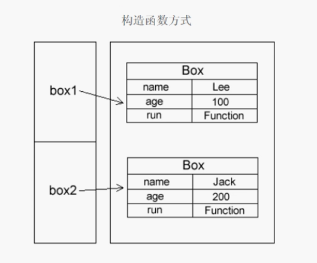
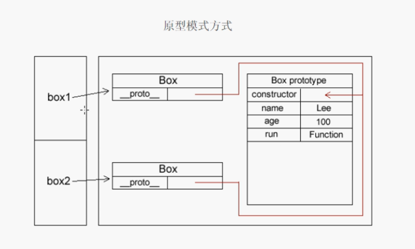
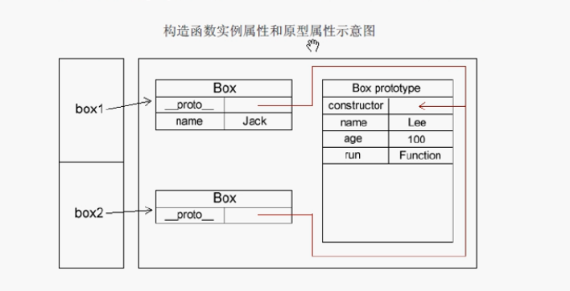
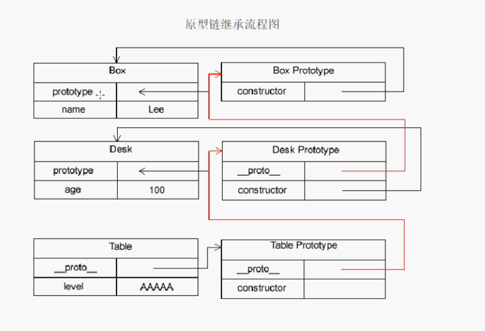

title: JavaScript
date: 2018-01-29 09:09:01
tags: ['JavaScript']
categories: ['JavaScript']
---
关于JavaScript面向对象与原型, 这块核心内容本姑娘已经通过不同的渠道,看书结合视频已经学习了三遍了; 总算能领会其中一点点的真谛了. 所以赶紧总结一下, 希望在以后的搬砖过程中能帮助我更加深入的去领悟;

## 面向对象与原型

### 创建对象
创建一个对象,并且给这个对象新建属性和方法.

``` javascript
var person = new Object();
person.name = 'LynnLi',
person.age = 26;
person.work() {
    return "go to work";
}
alert(person);        // [object Object]
alert(person.name);   // LynnLi
alert(person.work()); // go to work
```

``` javascript
var person = new Object();
person.name = 'LynnLi',
person.age = 26;
person.work() {
    return this.name + " "+ this.age + " go to work";
}
alert(person.work()); // LynnLi 26 go to work
```

> 上面创建了一个对象,并且创建属性和方法,在work()中的this 表示当前作用域下的对象, 也就是表示new Object()实例化出来的那个对象person.
> 这种JavaScript创建对象最基本的方法, 但是有个缺点,如果想要创建类似的对象,就会产生大量的代码, 如下:

例1
```javascript
var person = new Object();
person.name = 'LynnLi',
person.age = 26;
person.work() {
    return this.name + " "+ this.age + " go to work";
}

var person1 = new Object();
person1.name = 'RayJi',
person1.age = 27;
person1.work() {
    return this.name + " "+ this.age + " go to work";
}

alert(person.work()); // LynnLi 26 go to work
alert(person1.work()); // RayJi 27 go to work
```

例2
```javascript
var person = new Object();
person.name = 'LynnLi',
person.age = 26;
person.work() {
    return this.name + " "+ this.age + " go to work";
}

var person1 = person;
person1.name = 'RayJi',
person1.age = 27;
person1.work() {
    return this.name + " "+ this.age + " go to work";
}
alert(person.work()); // RayJi 27 go to work
alert(person1.work()); // RayJi 27 go to work
```

> 为了解决多个类似对象声明的问题, 可以使用工厂模式的方法,这种方法可以解决实例化对象产生大量重复代码的问题.

### 工厂模式

``` javascript
function createObject(name, age) {
    var obj = new Object();             // 创建对象
    obj.name = name;                    // 添加属性
    obj.age = age;
    obj.work = function() {             // 添加方法
        return this.name + " " + this.age + " go to work";
    }
    return obj;
}

var person = createObject("LynnLi", 26);
var person1 = createObject("RayJi", 27);

alert(person.work());
alert(person1.work());
```

> 工厂模式解决了重复实例化的问题, 但是还有一个问题, 就是根本无法识别他们是哪个对象的实例. 如下所示:

例1
```javascript
function createObject(name, age) {
    var obj = new Object();             // 创建对象
    obj.name = name;                    // 添加属性
    obj.age = age;
    obj.work = function() {             // 添加方法
        return this.name + " " + this.age + " go to work";
    }
    return obj;
}

var person = createObject("LynnLi", 26);
var person1 = createObject("RayJi", 27);

alert(typeof person);  // object
alert(typeof person1); // object

alert(person instanceof Object);  // true
alert(person1 instanceof Object); // true
```

例2
```javascript
function createObject(name, age) {
    var obj = new Object();             // 创建对象
    obj.name = name;                    // 添加属性
    obj.age = age;
    obj.work = function() {             // 添加方法
        return this.name + " " + this.age + " go to work";
    }
    return obj;
}

function createObject2(name, age) {
    var obj = new Object();             // 创建对象
    obj.name = name;                    // 添加属性
    obj.age = age;
    obj.work = function() {             // 添加方法
        return this.name + " " + this.age + " go to work";
    }
    return obj;
}

var person = createObject("LynnLi", 26);
var person1 = createObject("RayJi", 27);
var person2 = createObject2("RayLi", 28);

alert(person instanceof Object);  // true
alert(person1 instanceof Object); // true
alert(person2 instanceof Object); // true
```

> 不管怎么,他们都是Object类型, 根本无法区别谁是谁的对象.
> 为了解决如上的问题, ECMAScript中可以采用构造函数(构造方法)可用来解决特定的对象.

### 构造函数

``` javascript
function Person(name, age) {
    this.name = name;
    this.age = age;
    this.work = function() {
        return this.name + " " + this.age + " go to work";
    }
}

var person = Person("LynnLi", 26);
var person1 = Person("RayJi", 27);

alert(person.work()); // LynnLi 26 go to work
alert(person1.work()); // RayJi 27 go to work

alert(person instanceof Object);  // true
alert(person1 instanceof Object); // true
```

使用构造函数和使用工厂模式的方法之间的不同:
1. 构造函数方法没有显示的创建对象(new Object());
2. 直接将属性和方法赋值给对象;
3. 没有return语句, 构造函数后台自动返回;

构造函数规范:
1. 构造函数也是函数, 但是函数名第一个字母大写;
2. 必须new 构造函数明
3. 必须使用new运算符

> 使用构造函数的方法, 既解决了重复实例化的问题, 有解决了对象识别的问题. 但是问题是这里并没有new Object(), 为什么可以实例化Person(), 这里原理是什么?

例1
``` javascript
function Person(name, age) {
    this.name = name;
    this.age = age;
    this.work = function() {
        return this.name + " " + this.age + " go to work";
    }
}

function Animal(name, age) {
    this.name = name;
    this.age = age;
    this.run = function() {
        return this.name + " " + this.age + " running";
    }
}

var person = Person("LynnLi", 26);
var person1 = Person("RayJi", 27);
var animal = Animal("Cat", 2);

alert(person instanceof Object);  // true
alert(person1 instanceof Person); // true
alert(animal instanceof Person);  // false 识别了,但是animal是Animal的对象的引用
alert(animal instanceof Animal);  // true 
```

对象冒充调用

```javascript
function Person(name, age) {
    this.name = name;
    this.age = age;
    this.work = function() {
        return this.name + " " + this.age + " go to work";
    }
}

var obj = new Object();
// alert(obj.work());             // nothing
Person.call(obj, 'LynnLi', 26);   //对象冒充
alert(obj.work());                // LynnLi 26 go to work
```

> 在构造函数中如何使引用类型的值相等

例1
```javascript
function Person(name, age) {
    this.name = name;
    this.age = age;
    this.work = function() {  // 实例方法
        return this.name + " " + this.age + " go to work";
    }
}

var person = Person("LynnLi", 26);      // 实例化后地址不同
var person1 = Person("LynnLi", 26);     // 实例化后地址不同
alert(person.name = person1.name);      //true
alert(person.age = person1.age);        //true
alert(person.work() = person1.work());  //true 构造函数体内的方法的值是相等的

alert(person.work);
alert(person1.work);                // 两个打印是相同的

alert(person.work == person1.work); //false 因为他们比较的是引用地址
```

例2
可以把构造函数里的方法用new Function()方法来代替,得到一样的效果,更加证明,他们最终判断的是引用地址,唯一性;

```javascript
function Person(name, age) {
    this.name = name;
    this.age = age;
    this.work = new Function("return this.name + ' ' + this.age + ' go to work'");
}

var person = Person("LynnLi", 26);
var person1 = Person("LynnLi", 26);

alert(person.work == person1.work); //false 因为他们比较的是引用地址
```

例3 
我们可以通过构造函数外面绑定同一个函数的方法来保证引用地址的一致性
```javascript
function Person(name, age) {
    this.name = name;
    this.age = age;
    this.work = work;
}

function work() {   // 把构造函数内部的方法通过全局来实现引用地址一致
    return this.name + " " + this.age + " go to work";
}

var person = Person("LynnLi", 26);
var person1 = Person("LynnLi", 26);

alert(person.work == person1.work);     // true
alert(person.work() == person1.work()); // true

alert(work()); // NaN go to work
```

> 如上方式虽然解决了保证引用地址一致的问题, 但是这种方式又带来了一种新的问题, 全局中的this在对象调用的时候是Person本身, 而当普通函数调用的时候, this有代表window.

### 原型

我们创建每个函数都有一个prototype(原型)属性, 这个属性是一个对象, 他的用途是包含可以有特定类型的所有实例共享的属性个方法.

1. 原型
```javascript
function Person() {}

Person.prototype.name = "LynnLi";    // 原型属性
Person.prototype.age = 26;
Person.prototype.work = function() { // 原型方法
    return this.name + " " + this.age + " go to work";
}

var person = new Person();
alert(person.name);   // LynnLi
alert(person.work()); //LynnLi 26 go to work
```

2. 构造函数
```javascript
function Person(name, age) {
    this.name = name;         // 实例属性
    this.age = age;
    this.work = function() {  // 实例方法
        return this.name + " " + this.age + " go to work";
    }
}
```

> 如果是实例方法, 不同的实例化, 他们的方法地址是不一样的,是唯一的;
> 如果是原型方法, 那么他们的地址是共享的, 都一样;

```javascript
function Person() {}

Person.prototype.name = "LynnLi";    // 原型属性
Person.prototype.age = 26;
Person.prototype.work = function() { // 原型方法
    return this.name + " " + this.age + " go to work";
}

var person = new Person();
var person1 = new Person();

alert(person.work == person1.work); // true
alert(person.prototype);            // undefined 这个属性是一个对象,访问不到.
alert(person._proto_);              // [object Object] 这个属性是一个指针指向prototype原型对象, IE not support
alert(person.constructor);          // function Person() {}
// 构造属性, 可以获取构造函数本身,作用是被原型指针定位,然后得到构造函数本身.
```

为了进一步了解构造函数的声明方法和原型模式的声明方法, 我们通过图解来了解一下;



> 在原型模式声明中, 多了两个属性, 这两个属性都是创建对象时自动生成的._proto_属性是实例指向原型对象的一个指针, 它的作用就是指向构造函数的原型属性constructor. 通过这两个属性, 就可以访问到原型里的属性和方法.

如何判断一个对象是否指向了该构造函数的原型对象, 可以使用isPrototypeOf()方法来测试
```javascript
alert(Person.prototype.isPrototypeOf(person));

var person = new Person();
person.name = "rose"; //实例属性, 并没有重写原型属性
alert(person.name);   // rose 就近原则
```

例1
```javascript
function Person() {
    this.name = "Jack";
}

Person.prototype.name = "LynnLi";    // 原型属性
Person.prototype.age = 26;
Person.prototype.work = function() { // 原型方法
    return this.name + " " + this.age + " go to work";
}

var person = new Person();
alert(person.name);   // jack
```

原型模式的执行流程:
1. 先查找构造函数实例里的属性和方法, 如果有, 立即返回;
2. 如果构造函数实例里没有, 则去它的原型对象里找, 如果有, 就返回;

例2
```javascript
function Person() {}

Person.prototype.name = "LynnLi";    // 原型属性
Person.prototype.age = 26;
Person.prototype.work = function() { // 原型方法
    return this.name + " " + this.age + " go to work";
}

var person = new Person();
alert(person.name);   // LynnLi
```

例3
```javascript
function Person() {}

Person.prototype.name = "LynnLi";    // 原型属性
Person.prototype.age = 26;
Person.prototype.work = function() { // 原型方法
    return this.name + " " + this.age + " go to work";
}

var person = new Person();
person.name = "rose"; //实例属性, 并没有重写原型属性
alert(person.name);   // rose 就近原则

var person1 = new Person();
alert(person1.name);   // LynnLi
// 实例属性不会共享, 所以person1访问不到实例属性, 只能访问原型对象
```

例4
```javascript
function Person() {}

Person.prototype.name = "LynnLi";    // 原型属性
Person.prototype.age = 26;
Person.prototype.work = function() { // 原型方法
    return this.name + " " + this.age + " go to work";
}

var person = new Person();
person.name = "rose"; // 实例属性, 并没有重写原型属性
alert(person.name);   // rose 就近原则
delete person.name;   // 删除实例中的属性
alert(person.name);   // LynnLi

delete Person.prototype.name // 删除原型中的属性, 一般不会这样用
alert(person.name);          // undefined
```

如何判断属性是在构造函数的实例里,还是在原型? 可以使用hasOwnProperty()函数来验证.
```javascript
alert(person.hasOwnProperty("name")); // 实例里有返回true, 否则返回false
```



> in操作符会在通过对象能够访问给定属性时返回true, 无论该属性存在于实例中还是原型中

```javascript
alert('name' in person); // true, 存在实例中或者原型中
```

为了让属性和方法更好的体现封装的效果, 而且减少不必要的输出, 原型的创建可以使用字面量的方法:
```javascript
function Person() {}

var person = new Person();
alert(person.prototype); // 使用对象实例无法访问到prototype
alert(person._proto_);   // 使用对象实例访问prototype的指针
alert(Person.prototype); // 使用构造函数名(对象名)访问prototype
```

使用字面量的方式创建原型对象

```javascript
function Person() {}

Person.prototype = {
    name: "LynnLi",
    age: 26,
    work: function() {
        return this.name + " " + this.age + " go to work";
    }
}

var person = new Person();
alert(person.work());  // LynnLi 26 go to work
```

> 使用构造函数创建原型对象和使用字面量创建对象在使用上基本相同, 但是还是有一些区别, 字面量创建的方式使用constructor属性不会指向实例, 而会指向Object, 构造函数创建的方式则相反.

例1
```javascript
function Person() {}

Person.prototype.name = "LynnLi";    // 原型属性
Person.prototype.age = 26;
Person.prototype.work = function() { // 原型方法
    return this.name + " " + this.age + " go to work";
}

var person = new Person();
alert(person.constructor); //function Person() {}
alert(person.constructor == Object); // false
```

例2
```javascript
function Person() {}

Person.prototype = {
    name: "LynnLi",
    age: 26,
    work: function() {
        return this.name + " " + this.age + " go to work";
    }
}

var person = new Person();
alert(person.constructor);  // function Object() { [native code] }
alert(person.constructor == Object);  // true
```

PS: 字面量方式为什么constructor会指向Object? 因为Person.prototype={}; 这种写法其实就是创建了一个新对象. 而每创建一个函数, 就会同时创建它prototype, 这个对象也会自动获取constructor属性. 所以, 新对象的constructor重写了Person原来的constructor, 因此会指向新对象, 那么新对象没有指定构造函数, 那么就默认为Object. 

原型的声明是有先后顺序的, 所以, 重写的原型回切断之前的原型.
例1.
```javascript
function Person() {}

Person.prototype = {
    name: "LynnLi",
    age: 26,
    work: function() {
        return this.name + " " + this.age + " go to work";
    }
}

var person = new Person();
alert(person.work()); // LynnLi 26 go to work
alert(person.name); // LynnLi
```

例2.
```javascript
function Person() {}

Person.prototype = {
    name: "LynnLi",
    age: 26,
    work: function() {
        return this.name + " " + this.age + " go to work";
    }
}

// 重写原型
Person.prototype = {  // 不会保留之前原型的任何信息, 不会保留之前原型的任何信息, 把原来的原型对象和构造函数对象实例之前的关系切断了
    age: 200
}

var person = new Person();
alert(person.name); // undefined
```

内置引用类型的功能扩展
```javascript
String.prototype.addString = function() {
    return this + "add something";
}
```

> 原型模式创建对象也有自己的缺点, 它省略了构造函数传参这一过程,它的缺点就是初始化的值都是一致的. 而原型最大的缺点就是它最大的缺点, 那就是共享;

> 原型中所有属性是被很多实例共享的, 共享对于函数非常合适, 对于包含基本值的属性也还可以. 但是如果包含引用类型, 就存在一定的问题;

```javascript
function Person() {}

Person.prototype = {
    name: "LynnLi",
    age: 26,
    family: ['brother', 'mother', 'father'],
    work: function() {
        return this.name + " " + this.age + " go to work";
    }
}
var person = new Person();
alert(person.name);       // LynnLi
alert(person.family);     // brother mother father
person.family.push('sister')
alert(person.family);     // brother mother father sister

var person1 = new Person();
alert(person1.family);    // brother mother father sister
// 共享了person添加后的引用类型的原型
```

> 为了解决构造传参和共享的问题, 可以使用组合构造函数+原型模式

### 组合构造函数+原型模式

```javascript
function Person() {}

function Person(name, age) {  // 保持独立的用构造函数
    this.name = name;
    this.age = age;
    this.family = ['brother', 'mother', 'father'];
}

Person.prototype = {         // 保持共享的用原型
    constructor: Person,
    work: function() {
        return this.name + " " + this.age + " go to work";
    }
}

var person = new Person('LynnLi', 26);
alert(person.work()); // LynnLi 26 go to work
alert(person.family);     // brother mother father
person.family.push('sister')
alert(person.family);     // brother mother father sister

var person1 = new Person('Rayji', 27);
alert(person1.work()); // Rayji 27 go to work
alert(person.family);     // brother mother father
```

PS: 这种混合模式很好的解决了传参和引用共享的大难题

> 原型模式, 不管你是否调用了原型中的共享方法, 它都会初始化原型中的方法, 并且在声明一个对象时, 构造函数+原型部分让人感觉有很怪异, 最好就是把构造函数和原型封装到一起. 为了解决这个问题, 我们可以使用动态原型模式.

### 动态原型模式

```javascript
function Person() {}

function Person(name, age) {             // 保持独立的用构造函数
    this.name = name;
    this.age = age;
    this.family = ['brother', 'mother', 'father'];

    Person.prototype.work = function() { // 可以将原型封装到构造函数里
        return this.name + " " + this.age + " go to work";
    }
}

var person = new Person('LynnLi', 26);
alert(person.work());                   // LynnLi 26 go to work

var person1 = new Person('Rayji', 27);
alert(person1.work());                 // Rayji 27 go to work
```

> 如上方式导致原型每次初始化实例时,都会执行. 但是原型的初始化, 只要第一次初始化, 就可以啦! 没必要每次构造函数实例化的时候都初始化.

```javascript
function Person() {}

function Person(name, age) {
    this.name = name;
    this.age = age;
    this.family = ['brother', 'mother', 'father'];
    
    if(typeof this.work != 'function') {   // 仅在第一次调用时, 初始化.
        Person.prototype.work = function() {
            return this.name + " " + this.age + " go to work";
        }
    }
}

var person = new Person('LynnLi', 26);
var person1 = new Person('LynnLi1', 27);
var person2 = new Person('LynnLi2', 28);
```

> 如上创建对象的方式如果不能满足需求, 可以使用寄生构造函数

### 寄生构造函数

工厂模式+构造函数模式, 这种模式比较通用, 但是不能确定对象之间的关系. 所以, 在可以使用之前所说的模式时, 不建议使用此模式.

```javascript
function Person(name, age) {
    var obj = new Object();
    obj.name = name;
    obj.age = age;
    obj.work = function() {
        return this.name + " " + this.age + " go to work";
    };
    return obj;
} 

var person = new Person('LynnLi', 26);
alert(person.work());                   // LynnLi 26 go to work

var person1 = new Person('Rayji', 27);
alert(person1.work());                 // Rayji 27 go to work
```

### 稳妥构造函数

在一些安全的环境中, 比如禁止使用this和new, 这里的this是构造函数里不使用this, 这里的new是在外部实例化构造函数时不使用new, 这种创建方式叫做稳妥构造函数.


```javascript
function Person(name, age) {
    var obj = new Object();
    obj.name = name;
    obj.age = age;
    obj.work = function() {
        return this.name + " " + this.age + " go to work";
    };
    return obj;
} 

var person = Person('LynnLi', 26);
alert(person.work());                   // LynnLi 26 go to work

var person1 = Person('Rayji', 27);
alert(person1.work());                 // Rayji 27 go to work
```

### 继承

继承是面向对象中一个比较核心的概念. 其他正统面向对象语言都会用两种方式实现继承: 一个是接口实现, 一个是继承. 而ECMAScript只支持继承, 不支持接口实现, 而实现继承的方式依靠原型链完成.

```javascript
function Parent() {
    this.name = 'Jun';
}

function Child() {
    this.age = 20;
}

var child = new Child();
alert(child.age); // 20
alert(child.name); // undefined

// 通过原型链继承 超类行实例化后的对象实例, 赋值给子类型的原型属性
Child.prototype = new Parent();
alert(child.age); // 20
alert(child.name); // Jun
```



例1.
```javascript
function Parent() {
    this.name = 'Jun';
}

Parent.prototype.name = 'Jack';

function Child() {
    this.age = 20;
}

Child.prototype = new Parent();

var child = new Child();
alert(child.name); // Jun 就近原则 实例中有就返回, 没有就去查找原型
```

> 所有的构造函数都继承自Object, 而继承Object是自动完成的, 并不需要程序员手动继承.

子类型从属于自己或者他的超类型
```javascript
alert(child instanceof Child);    // true
alert(child instanceof Parent);   // true
alert(child instanceof Object);   // true
```

> 继承也有之前的问题, 比如字面量重写原型会中断关系, 使用引用类型的原型, 并且子类型还无法给超类行传递参数. 

> 为了解决引用共享和超类行无法传参的问题, 我们采用一种叫借用构造函数的技术, 或者成为对象冒充(伪造对象, 经典继承)的技术来解决这两个问题.

### 借用构造函数(对象冒充)
例1. 
```javascript
function Parent(name, age) {
    this.name = name;
    this.age = age;
    this.family = ['brother', 'monther', 'father'];
}

function Child(name, age) {
    Box.call(this, name, age); // 对象冒充
}

var child = new Child('lynnli', 26);
alert(child.name);            // lynnli
alert(child.family);          // brother monther father
```

例2. 
```javascript
function Parent(name, age) {
    this.name = name;
    this.age = age;
}

Parent.prototype.family = 'sister';

function Child(name, age) {
    Box.call(this, name, age); // 对象冒充
}

var child = new Child('lynnli', 26);
alert(child.name);            // lynnli
alert(child.family);          // undefined 对象冒充只能继承构造里的信息, 不能继承原型里的信息
```

例3.
```javascript
function Parent(name, age) {
    this.name = name;
    this.age = age;
    this.family = ['brother', 'monther', 'father']; // 引用类型, 放在构造里就不会被共享
}

function Child(name, age) {
    Box.call(this, name, age); // 对象冒充
}

var child = new Child('lynnli', 26);
alert(child.family);          // brother monther father
child.family.push('sister');
alert(child.family);          // brother monther father sister

var child1 = new Child('lynnli', 26);
alert(child1.family);          // brother monther father
```

例4.
```javascript
function Parent(name, age) {
    this.name = name;
    this.age = age;
    this.family = ['brother', 'monther', 'father'];
    // this.work = function() {
    //     return this.name + " " + this.age + " go to work";
    // }
    // 构造函数里的方法, 放在构造里, 每次实例化, 都会分配一个内存地址, 浪费空间. 所以放在原型里保证多次实例化只有一个地址
}

Parent.prototype.work = function() {
    return this.name + " " + this.age + " go to work";
}

function Child(name, age) {
    Box.call(this, name, age); // 对象冒充
}

var child = new Child('lynnli', 26);
alert(child.work());          // child.work is not a function
```

> 借用构造函数虽然解决了刚才的两个问题, 但是没有原型, 复用则无从谈起. 所以我们需要原型链+借用构造函数的模式, 这种模式成为组合模式.

### 组合模式
原型链+借用构造函数

```javascript
function Parent(name, age) {
    this.name = name;
    this.age = age;
    this.family = ['brother', 'monther', 'father'];
}

Parent.prototype.work = function() {
    return this.name + " " + this.age + " go to work";
}

function Child(name, age) {
    Box.call(this, name, age);    // 对象冒充
}

Child.prototype = new Parent();   // 原型链继承

var child = new Child('lynnli', 26);
alert(child.work());          // child.work is not a function
```

> 原型链继承之继承原型里面的, 对象冒充只继承构造里面的属性和方法.

> 还有一种继承模式叫做: 原型式继承, 这种继承借助原型并基于已有的对象创建新对象.同时还不必因此创建自定义类型.

### 原型式继承

临时中转函数
```javascript
function obj(o) {     // o 表示将要传递进去的一个对象
    function F() {}   // F构造是一个临时新建的对象, 用于存储传递过来的对象
    F.prototype = o;  // 将o对象实例赋值给F构造函数的原型对象
    return new F();   // 最后返回这个得到传递过来对象的实例对象
}
```

> F.prototype = o 其实就相当于 Child.prototype = new Parent();

这是字面量的声明方法, 相当于var box = new Box();
```javascript
var box = {
    name: 'lynnli',
    age: 26,
    family: ['brother', 'mother', 'father']
}
var box1 = obj(box);   // box1就等于new F()
alert(box1.name);      // lynnli
alert(box1.family);    // brother mother father
box1.family.push('sister');
alert(box1.family);    // brother mother father sister

var box2 = obj(box);   // box1就等于new F()
alert(box2.family);    // brother mother father sister

```

> 引用类型的属性共享了
> 寄生式继承把原型式+工厂模式结合而来, 目的是为了封装创建对象的过程.

### 寄生式继承

```javascript
// 临时中转函数
function obj(o) {
    function F() {}
    F.prototype = o;
    return new F();
}

// 寄生函数
function create(o) {
    vat f = obj(o);
    f.run = function() {
        return this.name + ' method';
    }
    return f;
}

var box = {
    name: 'lynnli',
    age: 26,
    family: ['brother', 'mother', 'father']
}

var box1 = create(box);
alert(box1.name);  // lynnli
alert(box1.run()); // lynnli method
```

> 组合式继承是JavaScript最常用的继承模式; 但是组合式继承也有意点小问题, 就是超类型在使用的过程中会被调用两次; 一次是创建子类型的时候, 另一次是子类型构造函数的内部, 寄生组合继承解决了如上问题

### 寄生组合继承

```javascript
// 临时中转函数
function obj(o) {
    function F() {}
    F.prototype = o;
    return new F();
}

// 寄生函数
function create(box, desk) {
    vat f = obj(box.prototype);
    desk.prototype = f;
}

function Box(name, age) {
    this.name = name;
    this.age = age;
}

Box.prototype.run = function() {
    return this.name + " " + this.age + " go to work";
}

function Desk(name, age) {
    Box.call(this, name, age);  // 对象冒充
}

// 通过寄生组合继承来实现继承
create(Box, Desk);             // 这句话用来替代Desk.prototype = new Box();

var desk = new Desk("lynnli", 26);
alert(desk.run());            // lynnli 26 go to work
alert(desk.constructor);      // function Box() {}
```

如上desk.constructor指向了Box, 所以代码如下:

```javascript
// 临时中转函数
function obj(o) {
    function F() {}
    F.prototype = o;
    return new F();
}

// 寄生函数
function create(box, desk) {
    vat f = obj(box.prototype);
    f.constructor = desk;       // 调整原型构造指针
    desk.prototype = f;
}

function Box(name, age) {
    this.name = name;
    this.age = age;
}

Box.prototype.run = function() {
    return this.name + " " + this.age + " go to work";
}

function Desk(name, age) {
    Box.call(this, name, age);  // 对象冒充
}

// 通过寄生组合继承来实现继承
create(Box, Desk);             // 这句话用来替代Desk.prototype = new Box();

var desk = new Desk("lynnli", 26);
alert(desk.run());            // lynnli 26 go to work
alert(desk.constructor);      // function Box() {}
```

More info:
* [JavaScript for Web Development](https://scotch.io/courses/getting-started-with-javascript)