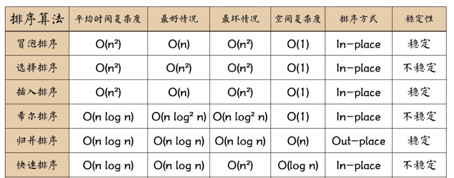

title: Sort Algorithm
date: 2018-02-06 09:09:01
tags: ['sort algorithm']
categories: ['sort algorithm']
---
排序算法可以分为内部排序和外部排序，内部排序是数据记录在内存中进行排序，而外部排序是因排序的数据很大，一次不能容纳全部的排序记录，在排序过程中需要访问外存。常见的内部排序算法有：插入排序、希尔排序、选择排序、冒泡排序、快速排序.用一张图概括：



## Quick Start

### 冒泡排序

冒泡排序（Bubble Sort）也是一种简单直观的排序算法。它重复地走访过要排序的数列，一次比较两个元素，如果他们的顺序错误就把他们交换过来。走访数列的工作是重复地进行直到没有再需要交换，也就是说该数列已经排序完成。这个算法的名字由来是因为越小的元素会经由交换慢慢“浮”到数列的顶端。

作为最简单的排序算法之一，冒泡排序给我的感觉就像 Abandon 在单词书里出现的感觉一样，每次都在第一页第一位，所以最熟悉。冒泡排序还有一种优化算法，就是立一个 flag，当在一趟序列遍历中元素没有发生交换，则证明该序列已经有序。但这种改进对于提升性能来说并没有什么太大作用。

##### 算法步骤
> 1. 比较相邻的元素。如果第一个比第二个大，就交换他们两个。
> 2. 对每一对相邻元素作同样的工作，从开始第一对到结尾的最后一对。这步做完后，最后的元素会是最大的数。
> 3. 针对所有的元素重复以上的步骤，除了最后一个。
> 4. 持续每次对越来越少的元素重复上面的步骤，直到没有任何一对数字需要比较。

##### 动图演示


###### 最快
当输入的数据已经是正序时

##### 最慢
当输入的数据是反序时

##### 代码实现
```javascript
function bubbleSort(arr) {
    var len = arr.length;
    for (var i = 0; i < len - 1; i++) {
        for (var j = 0; j < len - 1 - i; j++) {
            if (arr[j] > arr[j+1]) {        // 相邻元素两两对比
                var temp = arr[j+1];        // 元素交换
                arr[j+1] = arr[j];
                arr[j] = temp;
            }
        }
    }
    return arr;
}
```

### 选择排序

选择排序是一种简单直观的排序算法，无论什么数据进去都是 O(n²) 的时间复杂度。所以用到它的时候，数据规模越小越好。唯一的好处可能就是不占用额外的内存空间了吧。

##### 算法步骤

> 1. 首先在未排序序列中找到最小（大）元素，存放到排序序列的起始位置
> 2. 再从剩余未排序元素中继续寻找最小（大）元素，然后放到已排序序列的末尾。
> 3. 重复第二步，直到所有元素均排序完毕。

##### 动图演示


##### 代码实现
```javascript
function selectionSort(arr) {
    var len = arr.length;
    var minIndex, temp;
    for (var i = 0; i < len - 1; i++) {
        minIndex = i;
        for (var j = i + 1; j < len; j++) {
            if (arr[j] < arr[minIndex]) {     // 寻找最小的数
                minIndex = j;                 // 将最小数的索引保存
            }
        }
        temp = arr[i];
        arr[i] = arr[minIndex];
        arr[minIndex] = temp;
    }
    return arr;
}
```

### 插入排序

插入排序的代码实现虽然没有冒泡排序和选择排序那么简单粗暴，但它的原理应该是最容易理解的了，因为只要打过扑克牌的人都应该能够秒懂。插入排序是一种最简单直观的排序算法，它的工作原理是通过构建有序序列，对于未排序数据，在已排序序列中从后向前扫描，找到相应位置并插入。

插入排序和冒泡排序一样，也有一种优化算法，叫做拆半插入。

###### 算法步骤
> 1. 将第一待排序序列第一个元素看做一个有序序列，把第二个元素到最后一个元素当成是未排序序列。
> 2. 从头到尾依次扫描未排序序列，将扫描到的每个元素插入有序序列的适当位置。（如果待插入的元素与有序序列中的某个元素相等，则将待插入元素插入到相等元素的后面。）

##### 动图演示


##### 代码实现
```javascript
function  insertionSort ( arr ) {
     var len =  arr . length ;
     var preIndex, current;
     for ( var i =  1 ; i < len; i ++ ) {
        preIndex = i -  1 ;
        current = arr[i];
         while (preIndex >=  0  && arr[preIndex] > current) {
            arr[preIndex + 1 ] = arr[preIndex];
            preIndex -- ;
        }
        arr[preIndex + 1 ] = current;
    }
    return arr;
}
```

### 希尔排序

希尔排序，也称递减增量排序算法，是插入排序的一种更高效的改进版本。但希尔排序是非稳定排序算法。

希尔排序是基于插入排序的以下两点性质而提出改进方法的：

插入排序在对几乎已经排好序的数据操作时，效率高，即可以达到线性排序的效率；
但插入排序一般来说是低效的，因为插入排序每次只能将数据移动一位；
希尔排序的基本思想是：先将整个待排序的记录序列分割成为若干子序列分别进行直接插入排序，待整个序列中的记录“基本有序”时，再对全体记录进行依次直接插入排序。

##### 算法步骤
> 1. 选择一个增量序列t1，t2，……，tk，其中ti > tj, tk = 1；
> 2. 按增量序列个数k，对序列进行k 趟排序；
> 3. 每趟排序，根据对应的增量ti，将待排序列分割成若干长度为m 的子序列，分别对各子表进行直接插入排序。仅增量因子为1 时，整个序列作为一个表来处理，表长度即为整个序列的长度。

##### 代码实现
```javascript
function  shellSort ( arr ) {
     var len =  arr . length ,
        temp,
        gap =  1 ;
     while (gap < len / 3 ) {           //动态定义间隔序列 
        gap = gap * 3 + 1 ;
    }
    for (gap; gap >  0 ; gap =  Math . floor (gap / 3 )) {
         for ( var i = gap; i < len; i ++ ) {
            temp = arr[i];
             for ( var j = i - gap; j >=  0  && arr[j] > temp; j -= gap) {
                arr[j + gap] = arr[j];
            }
            arr[j + gap] = temp;
        }
    }
    return arr;
}
```

### 快速排序

快速排序是由东尼·霍尔所发展的一种排序算法。在平均状况下，排序n 个项目要Ο(nlogn) 次比较。在最坏状况下则需要Ο(n2) 次比较，但这种状况并不常见。事实上，快速排序通常明显比其他Ο(nlogn) 算法更快，因为它的内部循环（inner loop）可以在大部分的架构上很有效率地被实现出来。

快速排序使用分治法（Divide and conquer）策略来把一个串行（list）分为两个子串行（sub-lists）。

快速排序又是一种分而治之思想在排序算法上的典型应用。本质上来看，快速排序应该算是在冒泡排序基础上的递归分治法。

快速排序的名字起的是简单粗暴，因为一听到这个名字你就知道它存在的意义，就是快，而且效率高！它是处理大数据最快的排序算法之一了。虽然Worst Case 的时间复杂度达到了O(n²)，但是人家就是优秀，在大多数情况下都比平均时间复杂度为O(n logn) 的排序算法表现要更好，可是这是为什么呢，我也不知道。好在我的强迫症又犯了，查了N 多资料终于在《算法艺术与信息学竞赛》上找到了满意的答案：

> 快速排序的最坏运行情况是O(n²)，比如说顺序数列的快排。但它的平摊期望时间是O(nlogn)，且O(nlogn) 记号中隐含的常数因子很小，比复杂度稳定等于O(nlogn) 的归并排序要小很多。所以，对绝大多数顺序性较弱的随机数列而言，快速排序总是优于归并排序。

##### 算法步骤
> 1. 从数列中挑出一个元素，称为“基准”（pivot）;
> 2. 重新排序数列，所有元素比基准值小的摆放在基准前面，所有元素比基准值大的摆在基准的后面（相同的数可以到任一边）。在这个分区退出之后，该基准就处于数列的中间位置。这个称为分区（partition）操作；
> 3. 递归地（recursive）把小于基准值元素的子数列和大于基准值元素的子数列排序；
> 4. 递归的最底部情形，是数列的大小是零或一，也就是永远都已经被排序好了。虽然一直递归下去，但是这个算法总会退出，因为在每次的迭代（iteration）中，它至少会把一个元素摆到它最后的位置去。

##### 动图演示


##### 代码实现
```javascript
function  quickSort ( arr , left , right ) {
     var len =  arr . length ,
        partitionIndex,
        left =  typeof left !=  ' number '  ?  0  : left,
        right =  typeof right !=  ' number '  ? len -  1  : right;

    if (left < right) {
        partitionIndex =  partition (arr, left, right);
         quickSort (arr, left, partitionIndex - 1 );
         quickSort (arr, partitionIndex + 1 , right);
    }
    return arr;
}

function  partition ( arr , left , right ) {      //分区操作
    var pivot = left,                       //设定基准值（pivot） 
        index = pivot +  1 ;
     for ( var i = index; i <= right; i ++ ) {
         if (arr[i] < arr[pivot]) {
             swap (arr, i, index);
            index ++ ;
        }        
    }
    swap (arr, pivot, index -  1 );
     return index - 1 ;
}

function  swap ( arr , i , j ) {
     var temp = arr[i];
    arr[i] = arr[j];
    arr[j] = temp;
}
functiion paritition2 ( arr , low , high ) {
   let pivot = arr[low];
   while (low < high) {
     while (low < high && arr[high] > pivot) {
       -- high;
    }
    arr[low] = arr[high];
     while (low < high && arr[low] <= pivot) {
       ++ low;
    }
    arr[high] = arr[low];
  }
  arr[low] = pivot;
   return low;
}

function  quickSort2 ( arr , low , high ) {
   if (low < high) {
     let pivot =  paritition2 (arr, low, high);
     quickSort2 (arr, low, pivot -  1 );
     quickSort2 (arr, pivot +  1 , high) ;
  }
  return arr;
}
```